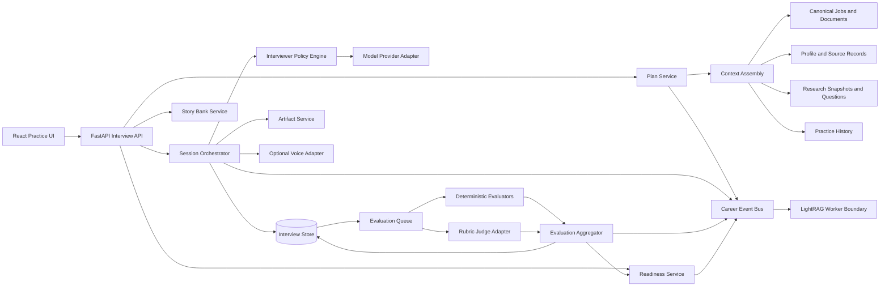
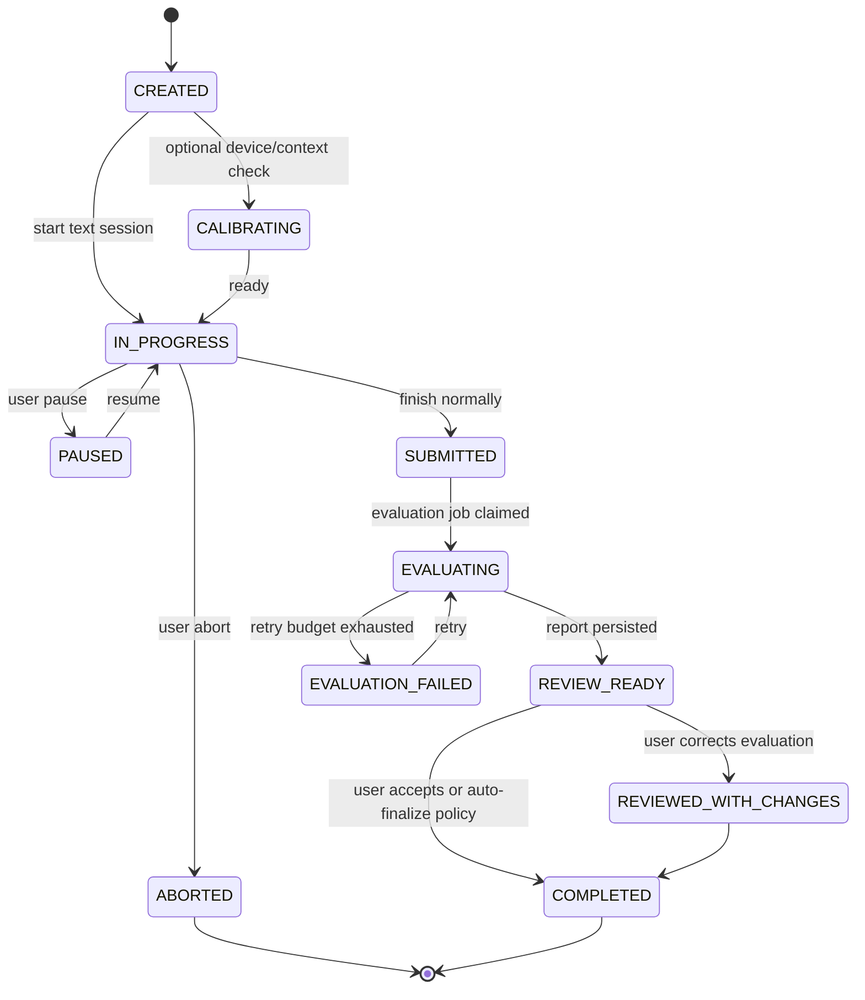

# Interview Readiness System — Full System Design

**Status:** Proposed  
**Target milestone:** v1.3 Interview Readiness  
**Repository:** `AlexKlick/new_jobs` / DenJobs Career Workspace  
**Date:** 2026-07-23  
**Primary user:** The workspace owner  
**Decision type:** Product architecture, data architecture, AI-system design, evaluation design

---

## 1. Executive summary

DenJobs should evolve from a job discovery and application-material workspace into a closed-loop **interview readiness system**. The system should convert each target job into a grounded preparation plan, run realistic text or voice mock interviews, score answers against explicit competency rubrics, preserve evidence for every score, schedule targeted drills, and measure whether weaknesses are actually improving.

The feature must extend the repository's existing strengths rather than create a disconnected mock-interview application:

- Job and application context already exists in the canonical application bundles.
- Company claims and likely interview questions already exist as provenance-backed research snapshots.
- Profile, experience, skill, resume, and cover-letter evidence already exists.
- Generic text/voice chat, TTS, and session persistence already exist.
- LightRAG career memory already provides an event/query boundary for longitudinal context.
- The React/FastAPI/PostgreSQL architecture already supports local-first operation and optional service boundaries.

The central architectural decision is:

> **Interview control flow, state transitions, scoring aggregation, evidence requirements, and practice scheduling are deterministic application logic. Models may generate, adapt, probe, classify, and coach, but they do not own the session state machine or invent unsupported candidate evidence.**

This avoids the common failure mode of treating a conversational model as the entire product. A good interview trainer needs repeatable rounds, stable rubrics, comparable attempts, traceable scores, controlled follow-ups, data retention rules, and regression tests.

### Recommended first release

The first useful release should support:

1. A job-specific interview plan generated from the job posting, submitted materials, company research, and the user's evidence bank.
2. Text-first mock sessions across recruiter, behavioral, FDE case/discovery, system design, applied-AI, and coding-verbalization rounds.
3. Evidence-linked post-session reports using anchored rubrics.
4. A targeted drill queue generated from demonstrated gaps.
5. A global readiness view and a per-job Interview tab.
6. Optional voice input/output after the text/session model is stable.

It should **not** initially include avatars, emotion analysis, personality inference, accent scoring, automated “hire probability,” leaked-company-question marketplaces, or uncontrolled autonomous interviewing.

---

## 2. Problem statement

The current repository can generate interview-preparation Markdown for a specific application, and company research can retain likely interview questions with provenance. That material is useful but static. It does not answer the operational questions required for skill development:

- Which competencies does this job actually test?
- Which claims in the submitted resume can support each answer?
- Has the user practiced the question aloud or only read it?
- Did the answer frame the problem, make a decision, explain trade-offs, and quantify impact?
- Which transcript spans justify a score?
- Is a weakness persistent across companies and interview formats?
- What should be practiced next, and why?
- Has the user improved after feedback and retry?
- Is the user prepared for the whole interview loop rather than one question?

Generic mock-interview products usually stop at a transcript and an opaque score. DenJobs can differentiate by combining **real target jobs, reusable career evidence, company intelligence, structured rubrics, longitudinal memory, and deliberate practice** in one local-first system.

---

## 3. Repository fit and reuse strategy

### 3.1 Existing capabilities to reuse

| Existing capability | Reuse in interview system |
|---|---|
| Canonical application inventory | Resolve job, company, submitted resume, cover letter, and application status |
| Structured profile and experience records | Candidate evidence and story-bank source material |
| Search candidates and job lists | Prioritize prep by job priority, interview stage, and compensation |
| Company research snapshots | Company signals and sourced likely questions |
| `research_interview_questions` | Provenance source feeding a canonical practice-question bank |
| Generic chat sessions | Reuse UI/voice transport selectively, not as the canonical interview record |
| TTS/STT services | Optional interview modality adapters |
| Generation provider abstraction | Model routing for question generation, interviewer turns, and coaching |
| LightRAG event boundary | Longitudinal strengths, weaknesses, stories, companies, and practice history |
| Quality/evaluation UI patterns | Report and rubric visualization |

### 3.2 Capabilities that must remain separate

The interview domain must not be stored only as a generic JSON chat transcript. The existing chat sessions are useful for ad hoc discussion, but interview practice requires first-class entities for:

- plans and rounds;
- questions and source provenance;
- attempts and follow-ups;
- time-boxes and session modes;
- rubric versions;
- score evidence;
- artifacts such as code and diagrams;
- user review and score correction;
- drill scheduling;
- readiness snapshots.

### 3.3 Storage direction

Use PostgreSQL as the canonical interview store when PostgreSQL is enabled. A local SQLite adapter may be retained for degraded/offline operation, but the domain interface must be storage-agnostic. Do not add another collection of per-feature JSON files as the authoritative state.

Generated Markdown remains useful as an export and human-readable artifact, not the primary source of truth.

---

## 4. Research synthesis and design implications

### 4.1 What current FDE roles evaluate

Current Forward Deployed Engineer descriptions emphasize an unusually broad execution surface:

- discovery and customer problem mapping;
- technical scoping and sequencing;
- full-stack architecture and implementation;
- production rollout, observability, security, and reliability;
- direct stakeholder and customer leadership;
- measurable workflow or mission impact;
- explicit trade-offs among scope, speed, and quality;
- conversion of field patterns into reusable tools and product feedback.

Therefore, the system must evaluate more than behavioral storytelling or algorithm puzzles. It needs job-specific loops that include ambiguity, discovery, architecture, production judgment, and communication at multiple levels.

### 4.2 What current engineering interview guidance evaluates

Official interview guidance from major AI/software employers commonly includes:

- pair coding or practical technical assessments;
- high-quality, testable, performant code;
- communication while solving;
- open-ended problem solving;
- reasoning inside existing systems rather than greenfield-only design;
- discussion of execution, judgment, failures, and lessons;
- multi-hour final loops involving multiple interviewers.

Implication: DenJobs needs separate practice modes for coding, existing-system debugging, system design, customer discovery, behavioral judgment, and full interview-loop endurance.

### 4.3 What practice research implies

The useful pattern is not repeated exposure to random questions. Effective practice is more likely when it includes:

- explicit competencies;
- repeated attempts;
- rapid and actionable feedback;
- segmented drills for a specific weakness;
- progressively harder scenarios;
- delayed full-session feedback when simulation fidelity matters;
- evidence of improvement across attempts.

The product therefore needs two distinct modes:

1. **Mock mode:** realistic interview conditions; no hints or corrections until the round ends.
2. **Coaching mode:** pause, explain the gap, retry the answer or segment, and increase difficulty after competence is demonstrated.

### 4.4 What AI evaluation research implies

LLM-based graders are useful but should not be treated as ground truth. The architecture should:

- evaluate outcomes and traces, not only final prose;
- use task-specific rubrics;
- decompose broad judgments into anchored criteria;
- run deterministic checks before model-based evaluation;
- require evidence spans for qualitative scores;
- version prompts, rubrics, and models;
- allow user correction and human calibration;
- monitor judge drift and disagreement.

---

## 5. Goals and non-goals

### 5.1 Goals

1. Generate a defensible interview plan for any promoted application.
2. Ground every plan in the actual job, company, submitted materials, and candidate evidence.
3. Simulate the major interview rounds used for FDE, Applied AI, and senior full-stack roles.
4. Give precise, evidence-linked feedback instead of generic encouragement.
5. Convert feedback into targeted drills and repeated attempts.
6. Track competency progression globally and per job.
7. Support text first and voice second without changing the domain model.
8. Preserve provenance for imported questions and candidate claims.
9. Work locally and degrade cleanly when cloud models, voice services, or graph memory are unavailable.
10. Produce reusable exports: prep plan, story bank, session report, and final interview brief.

### 5.2 Non-goals

- Predicting whether a company will hire the user.
- Scoring personality, emotional state, accent, attractiveness, or cultural conformity.
- Reproducing confidential or leaked interview questions.
- Claiming company-specific questions are certain when they are inferred.
- Replacing coding practice platforms in the first release.
- Running untrusted candidate code on the host without a sandbox.
- Fully autonomous job application or interview impersonation.
- Multi-user recruiting or employer-side candidate assessment.
- Video avatars or facial-expression analysis.

---

## 6. Primary user journeys

### 6.1 Job-specific preparation

1. User opens an application and selects **Interview**.
2. System resolves:
   - job posting and status;
   - submitted resume and cover letter;
   - profile and experience facts;
   - company research snapshot;
   - sourced likely questions;
   - prior sessions and known competency gaps.
3. User generates or refreshes an interview plan.
4. System displays expected rounds, competencies, question sources, evidence gaps, and recommended preparation order.
5. User starts a drill or a full mock.
6. Session is recorded as structured turns and optional artifacts.
7. Evaluation produces an evidence-linked report.
8. User accepts, edits, or disputes feedback.
9. Readiness and drill queues update.

### 6.2 Global practice

1. User opens **Practice** from global navigation.
2. System shows:
   - next recommended drill;
   - upcoming interview priorities;
   - persistent global weaknesses;
   - recent progress;
   - story-bank coverage gaps.
3. User starts a competency drill independent of one job.
4. Results update both global mastery and applicable job plans.

### 6.3 Rapid-cycle coaching

1. User selects one skill, such as “state assumptions before architecture.”
2. System presents a short scenario.
3. User responds for 60–180 seconds.
4. Coach identifies one or two material gaps.
5. User retries the same scenario or a controlled variant.
6. System compares attempts and records whether the targeted behavior improved.

### 6.4 Full loop simulation

1. User selects a role and session length.
2. Session orchestrator runs a sequence of rounds without mid-round coaching.
3. Time budget, question count, and follow-up policy are fixed at start.
4. A consolidated report separates:
   - recruiter communication;
   - behavioral evidence;
   - discovery and customer judgment;
   - system design;
   - applied AI reliability;
   - coding/execution;
   - questions asked by the candidate.
5. The system recommends the smallest set of high-leverage drills before the actual interview.

---

## 7. Competency model

The competency model must be explicit, versioned, job-adjustable, and anchored by observable behaviors.

### 7.1 Core competencies

| ID | Competency | Observable evidence |
|---|---|---|
| `DISCOVERY` | Customer and workflow discovery | Clarifies users, current workflow, exceptions, systems, volumes, incentives, baseline, and failure cost |
| `PROBLEM_FRAME` | Problem framing | Converts an ambiguous request into goals, constraints, assumptions, and decision criteria |
| `BUSINESS_VALUE` | Business-value reasoning | Connects design to revenue, cost, risk, throughput, adoption, or strategic learning |
| `SCOPE_SEQUENCE` | Scoping and sequencing | Defines MVP boundary, dependencies, milestones, de-risking experiments, and cut lines |
| `ARCHITECTURE` | System-design depth | Defines components, contracts, data flow, consistency, scaling, failure handling, and alternatives |
| `APPLIED_AI` | Model and agent judgment | Selects deterministic versus probabilistic components, model routing, retrieval, tools, memory, and human control |
| `EVALUATION` | Evals and evidence | Defines datasets, metrics, graders, baselines, failure taxonomy, regression gates, and online monitoring |
| `RELIABILITY` | Production reliability | Handles retries, idempotency, observability, fallback, rollback, incidents, and degraded operation |
| `SECURITY_PRIVACY` | Security and data governance | Addresses least privilege, secrets, PII, retention, tenancy, auditability, and threat boundaries |
| `IMPLEMENTATION` | Coding and execution | Produces correct, readable, tested, maintainable code and debugs systematically |
| `TRADEOFFS` | Technical judgment | Names alternatives and selects one using explicit constraints rather than listing options indefinitely |
| `STAKEHOLDER` | Stakeholder communication | Adjusts depth for engineer, operator, product leader, and executive audiences |
| `OWNERSHIP` | End-to-end ownership | Shows personal decisions, follow-through, escalation, learning, and measurable outcome |
| `COLLABORATION` | Collaboration and conflict | Explains alignment, disagreement, feedback, and cross-functional execution without blame |
| `CONCISION` | Answer structure and clarity | Leads with a thesis, organizes the answer, avoids irrelevant detail, and closes the loop |
| `CANDIDATE_QUESTIONS` | Reverse-interview quality | Asks informed questions that reveal product, team, deployment, growth, and equity realities |

### 7.2 Role-family weighting

Rubric weights should be generated from a role-family template and then adjusted from job evidence.

Example FDE weighting:

| Competency group | Default weight |
|---|---:|
| Discovery and problem framing | 18% |
| Business value, scope, and sequencing | 16% |
| Architecture and applied AI | 22% |
| Evaluation, reliability, security | 18% |
| Implementation and debugging | 12% |
| Stakeholder communication and ownership | 10% |
| Concision and candidate questions | 4% |

Weights are planning aids, not hiring probabilities.

### 7.3 Score anchors

Use a five-point anchored scale:

1. **Materially deficient:** misses the criterion or creates a high-risk answer.
2. **Developing:** identifies part of the issue but lacks structure, evidence, or a viable decision.
3. **Interview-credible:** covers the expected elements with a workable decision and minor gaps.
4. **Strong:** demonstrates depth, alternatives, explicit trade-offs, and relevant evidence.
5. **Exceptional:** combines depth, concision, business judgment, risk control, and reusable insight.

Every score above 1 must cite at least one transcript span or artifact. Every score below 3 must identify a concrete missing behavior and a recommended drill.

---

## 8. Functional requirements

### 8.1 Planning and grounding

- **INTV-PLAN-01:** Generate a versioned interview plan for a canonical job/application.
- **INTV-PLAN-02:** Record all plan inputs and their freshness: posting, resume, cover letter, profile revision, research snapshot, question sources, rubric version, and generation configuration.
- **INTV-PLAN-03:** Detect and display unsupported resume/story claims before they are used in answer coaching.
- **INTV-PLAN-04:** Infer likely rounds while clearly distinguishing sourced evidence from model inference.
- **INTV-PLAN-05:** Allow the user to add, remove, reorder, and time-box rounds.
- **INTV-PLAN-06:** Identify evidence gaps, such as a required competency with no credible story.

### 8.2 Question bank

- **INTV-Q-01:** Maintain a canonical question bank separate from immutable research snapshots.
- **INTV-Q-02:** Retain provenance and confidence for imported questions.
- **INTV-Q-03:** Tag questions by role family, competency, round type, difficulty, format, and expected artifact.
- **INTV-Q-04:** Deduplicate semantically equivalent questions without deleting source history.
- **INTV-Q-05:** Support generated scenario variants while preserving a parent template and generation trace.
- **INTV-Q-06:** Prevent claims that an inferred question is confirmed company practice.

### 8.3 Sessions

- **INTV-SES-01:** Create text-first interview sessions from a plan, drill, or ad hoc template.
- **INTV-SES-02:** Persist each interviewer and candidate turn as an immutable ordered record.
- **INTV-SES-03:** Support explicit modes: `mock`, `coaching`, `diagnostic`, and `full_loop`.
- **INTV-SES-04:** Enforce deterministic state transitions and time budgets.
- **INTV-SES-05:** Support follow-ups based on answer content while enforcing configured limits.
- **INTV-SES-06:** Support user pause, resume, abort, and retry semantics.
- **INTV-SES-07:** Attach optional code, diagram, notes, and uploaded artifacts to a turn.
- **INTV-SES-08:** Preserve model/provider/prompt configuration for reproducibility.

### 8.4 Evaluation

- **INTV-EVAL-01:** Run deterministic validators before qualitative evaluation.
- **INTV-EVAL-02:** Score only competencies applicable to the question or round.
- **INTV-EVAL-03:** Store transcript/artifact evidence for each score.
- **INTV-EVAL-04:** Separate observation, judgment, and recommendation.
- **INTV-EVAL-05:** Store evaluator type, model, prompt, rubric version, and confidence.
- **INTV-EVAL-06:** Support multiple evaluators and explicit disagreement.
- **INTV-EVAL-07:** Allow user review, correction, dismissal, and notes without deleting the original evaluation.
- **INTV-EVAL-08:** Compare retries against the targeted behavior rather than only comparing total score.

### 8.5 Drills and readiness

- **INTV-DRILL-01:** Generate targeted drills from material evaluation gaps.
- **INTV-DRILL-02:** Prioritize drills using job urgency, competency importance, gap severity, recency, and evidence quality.
- **INTV-DRILL-03:** Support rapid retry and controlled scenario variation.
- **INTV-READY-01:** Produce readiness bands per competency, job, and role family.
- **INTV-READY-02:** Show the evidence and uncertainty underlying readiness.
- **INTV-READY-03:** Avoid false precision and hiring-probability claims.
- **INTV-READY-04:** Preserve historical snapshots so progression can be audited.

### 8.6 Story bank

- **INTV-STORY-01:** Maintain reusable candidate stories linked to verified profile and project evidence.
- **INTV-STORY-02:** Store multiple answer lengths and audience variants.
- **INTV-STORY-03:** Map each story to competencies, stakes, decisions, metrics, failures, and lessons.
- **INTV-STORY-04:** Flag contradictions with submitted materials or other stories.
- **INTV-STORY-05:** Track whether a story has been practiced and how it performs.

### 8.7 Voice

- **INTV-VOICE-01:** Add STT and TTS as transport adapters over the same session API.
- **INTV-VOICE-02:** Show live transcription and permit correction before final submission in coaching mode.
- **INTV-VOICE-03:** Never score accent, voice identity, emotion, or inferred personality.
- **INTV-VOICE-04:** Make raw-audio retention explicit and configurable; default to deletion after transcription.

---

## 9. Non-functional requirements

### 9.1 Reliability

- No session turn may be lost after the API acknowledges it.
- Session state transitions must be idempotent.
- Evaluation failure must not corrupt or block transcript retrieval.
- A session must remain reviewable when the model provider, graph worker, or voice service is down.
- Background evaluation must be resumable.

### 9.2 Performance targets

Initial local targets, measured at p95 unless noted:

| Operation | Target |
|---|---:|
| Create session | < 300 ms excluding model generation |
| Persist turn | < 250 ms |
| Load active session | < 500 ms for 100 turns |
| First interviewer text token | < 3 s on configured remote model; report actual local-model latency separately |
| Deterministic evaluation | < 2 s per answer |
| Full qualitative evaluation | < 30 s per answer or async with progress |
| Readiness dashboard | < 1 s from materialized snapshot |

### 9.3 Accessibility

- All practice flows must work without voice.
- Controls must be keyboard accessible.
- Transcripts must remain available with clear speaker labels.
- Time limits must be adjustable or disableable.
- Feedback must not rely on color alone.

### 9.4 Explainability

- Every generated question displays its source class: sourced, adapted, generated, or user-authored.
- Every qualitative score displays evidence and rubric language.
- Every recommendation identifies the observed gap it is intended to address.

---

## 10. Architecture overview



### 10.1 Deployment shape

For the first release, keep the API in the existing FastAPI process but implement interview logic behind explicit service interfaces. Run long qualitative evaluations through a background worker abstraction. The first adapter may use an in-process `asyncio` queue for local simplicity, but the persistence model must support restart and retry. Do not rely on FastAPI `BackgroundTasks` as the authoritative queue.

Recommended progression:

1. In-process worker polling persisted evaluation jobs.
2. Separate local worker process using the same PostgreSQL tables.
3. Optional external queue only if scale or isolation requires it.

---

## 11. Bounded contexts and components

### 11.1 Interview Plan Service

Responsibilities:

- Build versioned plans from current job context.
- Infer rounds and competency weights.
- Select sourced and generated questions.
- Detect stale dependencies.
- Produce evidence-gap warnings.
- Never mutate research snapshots.

Inputs:

- canonical job/application;
- job posting text;
- submitted resume and cover letter;
- profile/source revision;
- company research snapshot;
- previous practice history;
- role-family template.

Outputs:

- plan;
- ordered rounds;
- competency weights;
- question assignments;
- grounding manifest;
- warnings.

### 11.2 Session Orchestrator

Responsibilities:

- Own the state machine.
- Load the next planned question.
- Apply follow-up policy.
- enforce time, attempt, and round limits;
- persist turns before requesting the next model action;
- expose pause/resume/finish semantics;
- enqueue evaluation.

The orchestrator must not delegate state ownership to an LLM.

### 11.3 Interviewer Policy Engine

The policy engine is a constrained decision layer. Given session state, the latest answer, and the active question, it may choose among allowed actions:

- `ASK_PLANNED_QUESTION`
- `ASK_CLARIFYING_FOLLOWUP`
- `ASK_DEPTH_FOLLOWUP`
- `ASK_TRADEOFF_FOLLOWUP`
- `REQUEST_ARTIFACT`
- `ADVANCE_QUESTION`
- `ADVANCE_ROUND`
- `END_SESSION`

Its output must conform to a schema and pass deterministic policy checks. The engine cannot exceed configured follow-up counts, inject new competencies silently, or reveal coaching feedback in mock mode.

### 11.4 Question Bank Service

Responsibilities:

- Import immutable research questions into canonical question records.
- Deduplicate using normalized text plus embedding similarity.
- Tag competencies and formats.
- Generate controlled variants.
- Track question exposure so practice is not dominated by memorization.

### 11.5 Story Bank Service

Responsibilities:

- Convert source/profile/project evidence into candidate-owned stories.
- Preserve links to verified facts.
- Generate 30-second, 90-second, and deep-dive structures.
- Detect unsupported metrics and contradictions.
- Match stories to question intent without forcing the same story into every answer.

### 11.6 Evaluation Service

Pipeline:

1. Normalize transcript and artifacts.
2. Run deterministic checks.
3. Select applicable rubric dimensions.
4. Run one or more qualitative evaluators.
5. Validate evidence citations.
6. Aggregate scores and disagreement.
7. Generate task-level feedback.
8. Generate an action plan and drills.
9. Await optional user review.
10. Update readiness from reviewed or sufficiently reliable evidence.

### 11.7 Readiness Service

Responsibilities:

- Maintain per-competency evidence history.
- Weight recent, relevant, and reviewed attempts more heavily.
- Avoid averaging unlike tasks without context.
- Produce bands and confidence rather than a fake exact probability.
- Generate the next-practice queue.

### 11.8 Artifact Service

Artifact types:

- code submission;
- architecture diagram;
- requirements notes;
- written answer;
- SQL/data model;
- API contract;
- uploaded supporting file.

Artifacts are immutable versions linked to a turn. Future code execution must run in a sandbox with explicit CPU, memory, time, filesystem, and network limits.

### 11.9 Provider Adapters

Separate provider adapters for:

- interviewer generation;
- qualitative evaluation;
- embedding/deduplication;
- transcription;
- speech synthesis.

A provider capability descriptor should declare structured-output support, context limits, cost class, locality, and data-retention suitability.

---

## 12. Session state machines

### 12.1 Session lifecycle



### 12.2 Turn lifecycle

1. Orchestrator chooses an allowed interviewer action.
2. Interviewer turn is generated and validated.
3. Turn is persisted.
4. Client acknowledges display/playback.
5. Candidate submits text/transcript and optional artifact.
6. Candidate turn is persisted atomically.
7. Lightweight validators run.
8. Session proceeds or finishes.

Retries must use an idempotency key supplied by the client. Duplicate submissions return the original persisted turn.

### 12.3 Plan lifecycle

`DRAFT -> READY -> ACTIVE -> SUPERSEDED | COMPLETED | ARCHIVED`

Refreshing a plan creates a new version. It must not rewrite the plan that produced historical sessions.

---

## 13. Proposed data model

The schema below is conceptual DDL. Implementation may use existing repository conventions, but entity boundaries and versioning semantics should be preserved.

### 13.1 Competencies and rubrics

```sql
CREATE TABLE interview_competencies (
    competency_id       TEXT PRIMARY KEY,
    label               TEXT NOT NULL,
    description         TEXT NOT NULL,
    active              BOOLEAN NOT NULL DEFAULT TRUE,
    created_at          TEXT NOT NULL,
    updated_at          TEXT NOT NULL
);

CREATE TABLE interview_rubrics (
    rubric_id           TEXT PRIMARY KEY,
    role_family         TEXT NOT NULL,
    version             INTEGER NOT NULL,
    label               TEXT NOT NULL,
    status              TEXT NOT NULL,
    definition          JSONB NOT NULL,
    created_at          TEXT NOT NULL,
    UNIQUE(role_family, version)
);
```

`definition` contains score anchors, applicable formats, competency weights, disqualifying omissions, and evidence requirements.

### 13.2 Canonical question bank

```sql
CREATE TABLE interview_questions (
    question_id             TEXT PRIMARY KEY,
    canonical_text          TEXT NOT NULL,
    normalized_hash         TEXT NOT NULL,
    source_class            TEXT NOT NULL,
    source_reference        JSONB,
    role_families           JSONB NOT NULL DEFAULT '[]'::jsonb,
    competencies            JSONB NOT NULL DEFAULT '[]'::jsonb,
    round_type              TEXT NOT NULL,
    response_format         TEXT NOT NULL DEFAULT 'spoken',
    difficulty              INTEGER NOT NULL DEFAULT 3,
    expected_duration_s     INTEGER,
    expected_artifact_type  TEXT,
    parent_question_id      TEXT REFERENCES interview_questions(question_id),
    generation_trace        JSONB,
    active                  BOOLEAN NOT NULL DEFAULT TRUE,
    created_at              TEXT NOT NULL,
    updated_at              TEXT NOT NULL
);

CREATE INDEX idx_interview_questions_round ON interview_questions(round_type);
CREATE INDEX idx_interview_questions_competencies
    ON interview_questions USING gin (competencies);
```

`source_class` values:

- `research_sourced`
- `official_process_sourced`
- `job_inferred`
- `role_template`
- `generated_variant`
- `user_authored`

### 13.3 Plans and rounds

```sql
CREATE TABLE interview_plans (
    plan_id                 TEXT PRIMARY KEY,
    job_index               INTEGER,
    role_family             TEXT NOT NULL,
    version                 INTEGER NOT NULL,
    status                  TEXT NOT NULL,
    label                   TEXT NOT NULL,
    target_interview_at     TEXT,
    rubric_id               TEXT NOT NULL REFERENCES interview_rubrics(rubric_id),
    grounding_manifest      JSONB NOT NULL,
    inferred_process        JSONB NOT NULL,
    warnings                JSONB NOT NULL DEFAULT '[]'::jsonb,
    generation_config       JSONB,
    created_at              TEXT NOT NULL,
    updated_at              TEXT NOT NULL,
    UNIQUE(job_index, version)
);

CREATE TABLE interview_plan_rounds (
    round_id                TEXT PRIMARY KEY,
    plan_id                 TEXT NOT NULL REFERENCES interview_plans(plan_id) ON DELETE CASCADE,
    round_order             INTEGER NOT NULL,
    round_type              TEXT NOT NULL,
    label                   TEXT NOT NULL,
    duration_s              INTEGER,
    competency_weights      JSONB NOT NULL,
    question_policy         JSONB NOT NULL,
    UNIQUE(plan_id, round_order)
);

CREATE TABLE interview_round_questions (
    assignment_id           TEXT PRIMARY KEY,
    round_id                TEXT NOT NULL REFERENCES interview_plan_rounds(round_id) ON DELETE CASCADE,
    question_id             TEXT NOT NULL REFERENCES interview_questions(question_id),
    question_order          INTEGER NOT NULL,
    required                BOOLEAN NOT NULL DEFAULT TRUE,
    rationale               TEXT,
    UNIQUE(round_id, question_order)
);
```

### 13.4 Sessions and turns

```sql
CREATE TABLE interview_sessions (
    session_id              TEXT PRIMARY KEY,
    plan_id                 TEXT REFERENCES interview_plans(plan_id),
    round_id                TEXT REFERENCES interview_plan_rounds(round_id),
    mode                    TEXT NOT NULL,
    modality                TEXT NOT NULL,
    status                  TEXT NOT NULL,
    active_question_index   INTEGER NOT NULL DEFAULT 0,
    started_at              TEXT,
    submitted_at            TEXT,
    completed_at            TEXT,
    time_budget_s           INTEGER,
    elapsed_s               INTEGER NOT NULL DEFAULT 0,
    interviewer_config      JSONB NOT NULL,
    retention_policy        JSONB NOT NULL,
    created_at              TEXT NOT NULL,
    updated_at              TEXT NOT NULL
);

CREATE TABLE interview_turns (
    turn_id                 TEXT PRIMARY KEY,
    session_id              TEXT NOT NULL REFERENCES interview_sessions(session_id) ON DELETE CASCADE,
    sequence_no             INTEGER NOT NULL,
    speaker                 TEXT NOT NULL,
    turn_type               TEXT NOT NULL,
    question_id             TEXT REFERENCES interview_questions(question_id),
    parent_turn_id          TEXT REFERENCES interview_turns(turn_id),
    content_text            TEXT NOT NULL,
    transcript_metadata     JSONB,
    policy_action           TEXT,
    model_trace             JSONB,
    duration_ms             INTEGER,
    idempotency_key         TEXT,
    created_at              TEXT NOT NULL,
    UNIQUE(session_id, sequence_no),
    UNIQUE(session_id, idempotency_key)
);
```

### 13.5 Artifacts

```sql
CREATE TABLE interview_artifacts (
    artifact_id             TEXT PRIMARY KEY,
    session_id              TEXT NOT NULL REFERENCES interview_sessions(session_id) ON DELETE CASCADE,
    turn_id                 TEXT REFERENCES interview_turns(turn_id),
    artifact_type           TEXT NOT NULL,
    version                 INTEGER NOT NULL,
    content_path            TEXT,
    content_text            TEXT,
    content_hash            TEXT NOT NULL,
    metadata                JSONB NOT NULL DEFAULT '{}'::jsonb,
    created_at              TEXT NOT NULL,
    UNIQUE(session_id, artifact_type, version)
);
```

### 13.6 Evaluation jobs and evidence

```sql
CREATE TABLE interview_evaluation_jobs (
    evaluation_job_id       TEXT PRIMARY KEY,
    session_id              TEXT NOT NULL REFERENCES interview_sessions(session_id),
    status                  TEXT NOT NULL,
    attempt_no              INTEGER NOT NULL DEFAULT 0,
    available_at            TEXT NOT NULL,
    claimed_at              TEXT,
    completed_at            TEXT,
    error_message           TEXT,
    created_at              TEXT NOT NULL
);

CREATE TABLE interview_evaluations (
    evaluation_id           TEXT PRIMARY KEY,
    session_id              TEXT NOT NULL REFERENCES interview_sessions(session_id),
    scope_type              TEXT NOT NULL,
    scope_id                TEXT NOT NULL,
    evaluator_type          TEXT NOT NULL,
    evaluator_config        JSONB NOT NULL,
    rubric_id               TEXT NOT NULL REFERENCES interview_rubrics(rubric_id),
    status                  TEXT NOT NULL,
    overall_summary         TEXT,
    confidence              DOUBLE PRECISION,
    created_at              TEXT NOT NULL
);

CREATE TABLE interview_competency_scores (
    score_id                TEXT PRIMARY KEY,
    evaluation_id           TEXT NOT NULL REFERENCES interview_evaluations(evaluation_id) ON DELETE CASCADE,
    competency_id           TEXT NOT NULL REFERENCES interview_competencies(competency_id),
    score                   DOUBLE PRECISION NOT NULL,
    observation             TEXT NOT NULL,
    performance_gap         TEXT,
    recommended_action      TEXT,
    confidence              DOUBLE PRECISION,
    created_at              TEXT NOT NULL
);

CREATE TABLE interview_score_evidence (
    evidence_id             TEXT PRIMARY KEY,
    score_id                TEXT NOT NULL REFERENCES interview_competency_scores(score_id) ON DELETE CASCADE,
    turn_id                 TEXT REFERENCES interview_turns(turn_id),
    artifact_id             TEXT REFERENCES interview_artifacts(artifact_id),
    start_offset            INTEGER,
    end_offset              INTEGER,
    evidence_text           TEXT NOT NULL,
    evidence_kind           TEXT NOT NULL,
    created_at              TEXT NOT NULL
);

CREATE TABLE interview_evaluation_reviews (
    review_id               TEXT PRIMARY KEY,
    evaluation_id           TEXT NOT NULL REFERENCES interview_evaluations(evaluation_id),
    review_status           TEXT NOT NULL,
    corrections             JSONB NOT NULL DEFAULT '[]'::jsonb,
    notes                   TEXT,
    created_at              TEXT NOT NULL
);
```

### 13.7 Story bank

```sql
CREATE TABLE interview_stories (
    story_id                TEXT PRIMARY KEY,
    title                   TEXT NOT NULL,
    status                  TEXT NOT NULL,
    situation               TEXT NOT NULL,
    task                    TEXT NOT NULL,
    actions                 JSONB NOT NULL,
    result                  TEXT NOT NULL,
    metrics                 JSONB NOT NULL DEFAULT '[]'::jsonb,
    lessons                 JSONB NOT NULL DEFAULT '[]'::jsonb,
    competencies            JSONB NOT NULL DEFAULT '[]'::jsonb,
    audience_variants       JSONB NOT NULL DEFAULT '{}'::jsonb,
    created_at              TEXT NOT NULL,
    updated_at              TEXT NOT NULL
);

CREATE TABLE interview_story_evidence_links (
    link_id                 TEXT PRIMARY KEY,
    story_id                TEXT NOT NULL REFERENCES interview_stories(story_id) ON DELETE CASCADE,
    source_type             TEXT NOT NULL,
    source_id               TEXT NOT NULL,
    claim_text              TEXT NOT NULL,
    verification_status     TEXT NOT NULL,
    created_at              TEXT NOT NULL
);
```

### 13.8 Drills and readiness

```sql
CREATE TABLE interview_drills (
    drill_id                TEXT PRIMARY KEY,
    competency_id           TEXT NOT NULL REFERENCES interview_competencies(competency_id),
    job_index               INTEGER,
    source_evaluation_id    TEXT REFERENCES interview_evaluations(evaluation_id),
    drill_type              TEXT NOT NULL,
    prompt_config           JSONB NOT NULL,
    target_behavior         TEXT NOT NULL,
    difficulty              INTEGER NOT NULL,
    status                  TEXT NOT NULL,
    priority_score          DOUBLE PRECISION NOT NULL,
    due_at                  TEXT,
    created_at              TEXT NOT NULL,
    updated_at              TEXT NOT NULL
);

CREATE TABLE interview_drill_attempts (
    attempt_id              TEXT PRIMARY KEY,
    drill_id                TEXT NOT NULL REFERENCES interview_drills(drill_id) ON DELETE CASCADE,
    session_id              TEXT NOT NULL REFERENCES interview_sessions(session_id),
    targeted_behavior_met   BOOLEAN,
    comparison              JSONB,
    created_at              TEXT NOT NULL
);

CREATE TABLE interview_readiness_snapshots (
    snapshot_id             TEXT PRIMARY KEY,
    job_index               INTEGER,
    role_family             TEXT NOT NULL,
    readiness_band          TEXT NOT NULL,
    confidence_band         TEXT NOT NULL,
    competency_state        JSONB NOT NULL,
    evidence_window         JSONB NOT NULL,
    generated_at            TEXT NOT NULL
);
```

### 13.9 Retention and deletion

Deletion semantics:

- Deleting a raw audio asset must not delete the accepted transcript.
- Deleting a session may soft-delete it first, then hard-delete dependent turns/evidence under an explicit purge action.
- Research source snapshots remain immutable even if imported practice questions are archived.
- User corrections append review records rather than rewriting the original evaluator output.

---

## 14. API design

All write endpoints accept `Idempotency-Key` where duplicate client submission is plausible.

### 14.1 Plans

#### `POST /api/interview/plans/{job_index}/generate`

Request:

```json
{
  "role_family": "forward_deployed_ai_engineer",
  "target_interview_at": "2026-08-15T16:00:00Z",
  "refresh_company_research": false,
  "include_coding_round": true,
  "provider_policy": "local_preferred"
}
```

Response: `202 Accepted` with generation job or completed plan when fast enough.

#### `GET /api/interview/plans/{job_index}`

Returns active plan summary plus stale-dependency warnings.

#### `GET /api/interview/plans/{plan_id}/versions`

Returns immutable plan history.

#### `PATCH /api/interview/plans/{plan_id}`

Allows user changes to timing, round order, question inclusion, and status. Grounding inputs are not silently replaced.

### 14.2 Sessions

#### `POST /api/interview/sessions`

```json
{
  "plan_id": "plan_...",
  "round_id": "round_...",
  "mode": "mock",
  "modality": "text",
  "time_budget_s": 2700,
  "retention_policy": {
    "retain_transcript": true,
    "retain_raw_audio": false
  }
}
```

#### `POST /api/interview/sessions/{session_id}/start`

Transitions `CREATED` or `CALIBRATING` to `IN_PROGRESS` and returns the first interviewer turn.

#### `POST /api/interview/sessions/{session_id}/turns`

```json
{
  "content_text": "I would begin by identifying...",
  "duration_ms": 184000,
  "artifact_ids": [],
  "transcript_metadata": {
    "source": "typed"
  }
}
```

Returns the persisted candidate turn and, when appropriate, the next interviewer action.

#### `POST /api/interview/sessions/{session_id}/pause`

#### `POST /api/interview/sessions/{session_id}/resume`

#### `POST /api/interview/sessions/{session_id}/finish`

Returns evaluation job state.

#### `GET /api/interview/sessions/{session_id}`

Returns session state and paginated turns.

### 14.3 Reports and review

#### `GET /api/interview/sessions/{session_id}/report`

Returns deterministic checks, competency scores, evidence spans, evaluator disagreement, action plan, and drill recommendations.

#### `POST /api/interview/evaluations/{evaluation_id}/review`

```json
{
  "review_status": "accepted_with_changes",
  "corrections": [
    {
      "score_id": "score_...",
      "replacement_score": 4,
      "reason": "The cited transcript omitted the following trade-off discussion."
    }
  ],
  "notes": "Use this corrected result for readiness."
}
```

### 14.4 Drills and readiness

- `GET /api/interview/drills/next?job_index={id}`
- `POST /api/interview/drills/{drill_id}/start`
- `POST /api/interview/drills/{drill_id}/complete`
- `GET /api/interview/readiness`
- `GET /api/interview/readiness/jobs/{job_index}`
- `GET /api/interview/readiness/history`

### 14.5 Story bank

- `GET /api/interview/stories`
- `POST /api/interview/stories`
- `GET /api/interview/stories/{story_id}`
- `PATCH /api/interview/stories/{story_id}`
- `POST /api/interview/stories/{story_id}/verify`
- `POST /api/interview/stories/suggest-from-profile`

### 14.6 Voice

- `POST /api/interview/sessions/{session_id}/audio`
- `GET /api/interview/sessions/{session_id}/audio/{asset_id}` only when retained
- `POST /api/interview/sessions/{session_id}/transcripts/{turn_id}/correct`

Voice transport should return partial transcription events over the existing practical transport selected by the UI. WebSocket or Server-Sent Events may be introduced only when required; the persistence contract remains ordinary HTTP.

---

## 15. Question generation and provenance

### 15.1 Context assembly order

The plan generator should assemble context in this order:

1. Canonical job posting and role requirements.
2. Submitted resume and cover letter.
3. Structured profile and source facts.
4. Current company research snapshot.
5. Sourced interview questions.
6. Official hiring-process evidence when available.
7. Prior sessions for this job.
8. Global competency history.

Every context item receives:

- source type;
- source identifier;
- revision/snapshot ID;
- collected or modified timestamp;
- trust level;
- allowed uses.

### 15.2 Question-selection policy

A plan should intentionally mix:

- sourced company/process questions;
- role-family canonical questions;
- questions triggered by specific resume claims;
- open-ended scenarios adapted to the employer's domain;
- weakness-targeted questions;
- novel transfer questions to detect memorized scripts.

The user should see why each question was selected.

### 15.3 Follow-up generation

Follow-ups should target one of a limited set of gaps:

- ambiguous assumption;
- missing baseline or scale;
- unsupported claim;
- omitted alternative;
- missing failure mode;
- weak business outcome;
- unclear personal ownership;
- missing security/evaluation detail;
- contradiction with prior answer.

A follow-up must include an internal reason code. The reason code is stored for evaluation but not shown during mock mode.

---

## 16. Evaluation architecture

### 16.1 Layer 1: deterministic checks

Examples:

- answer present and within configured length/time constraints;
- requested artifact supplied;
- code parses, compiles, or passes tests when sandbox execution exists;
- architecture answer mentions required high-risk dimensions selected by the rubric;
- numeric claims map to candidate evidence or are marked as estimates;
- transcript evidence offsets are valid;
- interviewer policy stayed within follow-up and timing constraints;
- no hidden coaching leaked in mock mode.

Deterministic checks should not reward keyword stuffing. They identify observable omissions and contract failures.

### 16.2 Layer 2: rubric evaluators

Qualitative evaluators receive:

- exact rubric anchors;
- only the relevant transcript and artifacts;
- grounding references needed to check candidate claims;
- deterministic findings;
- an output schema requiring observations, evidence, score, uncertainty, and recommended action.

The evaluator must separate:

1. **Observation:** What the candidate did or omitted.
2. **Judgment:** How that maps to the rubric.
3. **Action:** The smallest concrete improvement.

### 16.3 Layer 3: aggregation and disagreement

Use at least two evaluator paths for high-value full-loop sessions when resources permit:

- a primary rubric evaluator;
- a focused critic or second evaluator on material dimensions.

Do not average blindly. Persist disagreements such as:

- score distance greater than one anchor;
- contradictory evidence;
- unsupported evaluator claim;
- low-confidence judgment;
- rubric not applicable.

Flag these for user review or exclude them from readiness updates.

### 16.4 Feedback format

For each answer:

- **Thesis:** one-sentence assessment.
- **What worked:** no more than three evidence-linked items.
- **Material gaps:** no more than three items ordered by interview impact.
- **Improved structure:** concise answer outline, not a fabricated personal story.
- **Next drill:** one targeted behavior and success criterion.

For each session:

- round summary;
- competency matrix;
- strongest evidence;
- repeated failure patterns;
- contradictions;
- highest-leverage next actions;
- readiness effect and uncertainty.

### 16.5 Evaluator calibration

Create a local calibration set containing:

- anonymized/synthetic answers;
- user-reviewed historical answers;
- expected rubric bands;
- required evidence spans;
- known failure cases.

Before changing a judge model or prompt, run the calibration set and compare:

- score agreement;
- evidence validity;
- false-positive praise;
- false-negative criticism;
- actionability;
- cost and latency.

No judge change should silently rewrite historical results.

---

## 17. Adaptive practice and readiness

### 17.1 Readiness is evidence, not a probability

The system should report:

- `NOT_READY`
- `DEVELOPING`
- `INTERVIEW_READY`
- `STRONG`

Each band includes a confidence band and supporting evidence. It must not report “82% chance of passing.”

### 17.2 Evidence weighting

A readiness update considers:

- relevance to target role and round;
- difficulty;
- recency;
- whether the attempt was first exposure or a retry;
- mock versus coached conditions;
- evaluator agreement;
- user review status;
- evidence diversity across questions;
- transfer performance on novel scenarios.

Coached retries prove skill acquisition but should not count as strongly as later unassisted transfer.

### 17.3 Drill priority

A practical priority function:

```text
priority =
    job_urgency
  × competency_weight
  × gap_severity
  × evidence_confidence
  × forgetting_pressure
  × transfer_need
  - recent_overpractice_penalty
```

The UI should explain priority qualitatively rather than expose pseudo-scientific decimals.

### 17.4 Drill types

- thesis-first answer;
- clarify-before-solving;
- workflow exception discovery;
- quantify business impact;
- compare two architectures and choose;
- enumerate failure modes;
- define an eval plan;
- explain to an executive;
- explain to an engineer;
- defend a resume claim;
- behavioral story ownership;
- coding think-aloud;
- incident/debugging diagnosis;
- reverse-interview question practice.

---

## 18. User interface specification

### 18.1 Global navigation

Add a top-level **Practice** route with:

- Today / next recommended work;
- upcoming interviews;
- role-family readiness;
- competency heatmap;
- drill queue;
- recent sessions;
- story-bank coverage;
- calibration and data settings.

### 18.2 Job detail Interview tab

Sections:

1. **Plan** — expected rounds, timing, sources, warnings, and refresh state.
2. **Practice** — recommended drills and full mocks.
3. **Questions** — source class, confidence, competency, and practice history.
4. **Stories** — evidence-backed stories applicable to this role.
5. **Progress** — per-job readiness and session history.
6. **Final brief** — concise pre-interview review artifact.

### 18.3 Live session UI

Required elements:

- session mode and round;
- timer and progress;
- interviewer prompt;
- response input or live transcript;
- optional notes/artifact pane;
- pause and finish controls;
- explicit recording/retention state;
- no feedback indicators in mock mode.

For system-design practice, include a simple diagram canvas only after the text flow is stable. Store a structured export plus an image/SVG representation where possible.

### 18.4 Report UI

The report must support evidence inspection:

- clicking a rubric score jumps to transcript spans or artifacts;
- deterministic and qualitative findings are visually distinct;
- evaluator disagreement is visible;
- user can accept, correct, or dismiss a finding;
- next drills are linked directly to start actions;
- comparison view shows first attempt versus retry.

### 18.5 Final brief export

Generate a concise Markdown/PDF artifact containing:

- 90-second background pitch;
- why this company/role;
- top stories and metrics;
- architecture topics to review;
- known gaps and bridge answers;
- company-specific questions to ask;
- logistics and interview plan.

The export must be generated from canonical interview data and verified candidate evidence, not from an untracked free-form prompt.

---

## 19. Voice and realtime design

### 19.1 Voice is an adapter

The domain consumes finalized candidate text and timing metadata. Voice adds:

- audio capture;
- streaming or batched transcription;
- optional correction;
- speech synthesis for interviewer turns;
- playback state.

The interview session remains usable when all voice services are disabled.

### 19.2 Retention defaults

Default local policy:

- retain corrected transcript;
- retain timing and transcription confidence metadata;
- delete raw audio after successful transcription;
- allow explicit “retain this recording” per session;
- never send audio to a cloud provider unless provider policy allows it and the UI discloses it.

### 19.3 What not to score

Do not score:

- accent;
- vocal pitch;
- inferred emotion;
- disability-related speech characteristics;
- demographic or personality attributes;
- eye contact or facial expression.

Permitted communication observations should be text/timing grounded and user-controllable, such as excessive answer length, missing structure, repeated filler transcription tokens with low confidence, or failure to answer the question. Even these should be framed as practice observations, not identity judgments.

---

## 20. Security, privacy, and safety

Use the NIST AI Risk Management Framework concepts of govern, map, measure, and manage as an organizing model.

### 20.1 Data classification

Classify inputs:

- public job/company material;
- user-authored profile and stories;
- confidential employer/client project details;
- submitted application documents;
- voice/audio;
- model traces and provider metadata;
- secrets and credentials.

### 20.2 Core controls

- Local-first storage and provider choice.
- Explicit provider-routing policy per session.
- Redact API keys, credentials, and obvious sensitive identifiers before model calls.
- Store source hashes and IDs instead of duplicating confidential documents into traces where possible.
- Use least-privilege file access.
- Never permit generated interview content to modify application files without the existing agent checkpoint/rollback boundary.
- Validate all structured model output.
- Escape rendered Markdown and transcript content.
- Apply size limits to transcripts and artifacts.
- Use content hashes and immutable versions for artifacts.
- Audit plan generation, session actions, evaluations, user corrections, and exports.

### 20.3 Prompt injection boundary

Job postings, company webpages, resumes, and research documents are untrusted content. Context assembly must wrap them as data and prohibit instructions inside those documents from changing system behavior. Models receive explicit source delimiters and allowed-use metadata.

### 20.4 Unsupported claim control

The system may help structure the user's real work but must not invent experience, metrics, customers, production scale, or technical ownership. Generated answer suggestions must cite candidate evidence or include a visible placeholder/qualification.

---

## 21. Observability and system evaluation

### 21.1 Operational telemetry

Capture:

- session and round latency;
- model first-token and completion latency;
- provider/model selection;
- token/cost usage;
- schema-validation failures;
- policy-action distribution;
- follow-up count;
- evaluation queue age and retry count;
- evidence-citation validation rate;
- voice transcription error/correction rate;
- storage and worker health;
- readiness recalculation duration.

Do not put raw confidential transcripts into general logs.

### 21.2 Product metrics

Useful metrics:

- plan-to-first-practice conversion;
- completed sessions per target job;
- percentage of reports reviewed;
- drill retry completion;
- targeted-behavior improvement rate;
- transfer performance on novel questions;
- question diversity;
- percentage of scores with valid evidence;
- user-overridden evaluation rate;
- time from interview scheduling to readiness;
- actual interview stage outcomes when manually entered.

Interview outcomes may help retrospective analysis, but the system must not treat them as a clean label for individual answer quality because hiring processes contain many confounders.

### 21.3 Evals for the interviewer agent

Test suites should include:

- asks one question at a time;
- follows the configured round plan;
- does not exceed follow-up limits;
- does not reveal coaching in mock mode;
- asks a relevant follow-up when a specified gap exists;
- does not invent company facts;
- does not solicit protected/private information;
- ends the round on time;
- handles short, long, contradictory, or off-topic answers;
- remains functional when model output is malformed.

### 21.4 Evals for the grader

Test suites should include:

- evidence span exists and supports the claim;
- rubric applicability is correct;
- score anchors are used consistently;
- unsupported praise is rejected;
- material omissions are detected;
- evaluator does not penalize style unrelated to the rubric;
- deterministic findings are not contradicted without explanation;
- user corrections remain visible and influence readiness according to policy.

---

## 22. Failure modes and degradation

| Failure | Required behavior |
|---|---|
| Interviewer model unavailable | Preserve state; allow retry or switch provider; never lose answer |
| Malformed interviewer output | Reject, retry with repair once, then use deterministic fallback question |
| Evaluation worker unavailable | Session remains complete and reviewable; report shows pending state |
| Judge disagreement | Show disagreement; do not silently average high-impact conflicts |
| Graph worker unavailable | Core session/readiness store works; graph-backed history marked degraded |
| Voice transcription failure | Preserve audio temporarily and permit retry/manual text entry |
| Research snapshot stale | Display warning; do not block practice unless user requires refresh |
| Job posting removed | Continue from immutable captured context; show posting status |
| Candidate evidence conflict | Flag before answer generation; require user resolution or qualified wording |
| Session interrupted | Resume from last acknowledged turn and deterministic state |
| Duplicate client submission | Return existing turn through idempotency key |
| Excessive context | Summarize only through provenance-preserving context views; never silently truncate critical rubric or question data |

---

## 23. Implementation phases

### Phase A — Domain foundation and text practice

Scope:

- interview schema and storage interface;
- competency/rubric seeds;
- question import from research snapshots;
- story-bank CRUD;
- plan generation and grounding manifest;
- text session state machine;
- deterministic checks;
- basic report and manual review;
- per-job Interview tab.

Exit criteria:

- One job can produce an immutable plan.
- User can complete and resume a text mock.
- Every turn is structured and durable.
- Report scores cite valid transcript evidence.
- No unsupported candidate claims are emitted as facts.

### Phase B — Deliberate-practice loop

Scope:

- drill generation;
- rapid retry;
- attempt comparison;
- readiness snapshots;
- global Practice page;
- final brief export.

Exit criteria:

- A material gap creates a targeted drill.
- Retry comparison measures the targeted behavior.
- Readiness explains its evidence and uncertainty.

### Phase C — Voice integration

Scope:

- voice session adapter;
- live/batched transcript UI;
- TTS interviewer playback;
- retention controls;
- transcription correction.

Exit criteria:

- Same session can run text-only or voice without domain-model differences.
- Raw audio deletion policy is verified.
- Voice failure degrades to text.

### Phase D — System design and coding artifacts

Scope:

- diagram artifact pane;
- code editor artifact;
- sandboxed execution worker;
- tests and artifact-aware grading;
- existing-system debugging scenarios.

Exit criteria:

- Untrusted code cannot access host filesystem/network outside policy.
- Grader evaluates code/tests plus explanation.
- Diagram evidence can be linked to rubric scores.

### Phase E — Adaptive intelligence and graph integration

Scope:

- practice-priority engine;
- transfer-question generation;
- cross-company competency history;
- graph events and read models;
- calibrated multi-evaluator path.

Exit criteria:

- Persistent weakness is visible across jobs.
- Provider/judge changes pass calibration gates.
- Graph failure does not break core workflows.

### Phase F — Verification and audit

Scope:

- end-to-end tests;
- model-eval suites;
- accessibility review;
- retention/security audit;
- planning-doc reconciliation;
- performance receipts.

Exit criteria:

- Root requirements and roadmap match implementation truth.
- Every requirement has explicit evidence.
- Known limitations are documented in the UI and repo.

---

## 24. Testing strategy

### 24.1 Unit tests

- state transition guards;
- question-policy limits;
- rubric applicability;
- readiness weighting;
- drill-priority ordering;
- provenance conversion;
- evidence-offset validation;
- idempotency;
- stale dependency detection;
- retention-policy decisions.

### 24.2 Integration tests

- generate plan from a fixture application;
- import research question without mutating snapshot;
- complete/resume/abort session;
- enqueue, retry, and complete evaluation;
- user correction changes readiness input but preserves original evaluation;
- provider failure and fallback;
- PostgreSQL restart recovery;
- graph and voice degraded modes.

### 24.3 End-to-end tests

1. Promote job -> generate plan -> run text mock -> receive report -> accept feedback -> complete drill -> observe readiness history.
2. Refresh company research -> create new plan version -> historical session retains old grounding manifest.
3. Start voice session -> transcription failure -> switch to text -> finish successfully.
4. Submit duplicate turn -> one canonical turn persists.
5. Malicious instructions inside job posting -> context remains data and policy is unchanged.
6. Unsupported metric in generated answer outline -> claim is blocked or visibly qualified.

### 24.4 Model evaluation fixtures

Build fixture sets for:

- strong/weak discovery answers;
- plausible but unsupported metrics;
- architecture answers with missing failure modes;
- rambling but technically correct answers;
- concise but shallow answers;
- contradictory behavioral stories;
- model attempts to over-praise;
- interviewer stacked-question failures;
- policy violations in mock/coaching modes.

### 24.5 Manual verification

- voice usability;
- transcript evidence navigation;
- report usefulness;
- system-design canvas;
- keyboard-only flow;
- local model latency;
- confidential-data routing;
- final brief fidelity to submitted materials.

---

## 25. Acceptance criteria for initial release

1. Interview prep is reachable from a canonical job without manually locating Markdown files.
2. A plan records exact source revisions and marks inferred versus sourced content.
3. A session survives process restart without losing acknowledged turns.
4. Mock mode gives no coaching until the round ends.
5. Coaching mode supports retry and comparison.
6. Reports use anchored rubrics and valid evidence spans.
7. A low score produces a specific drill with a measurable target behavior.
8. User corrections preserve evaluator history.
9. Readiness is a band with evidence and uncertainty, not a hiring probability.
10. Voice is optional and raw audio is deleted by default after transcription.
11. No accent, emotion, personality, or demographic scoring exists.
12. Research snapshots remain immutable.
13. Unsupported career claims are blocked or qualified.
14. Core practice works when graph, voice, or one model provider is unavailable.
15. Tests cover state, provenance, idempotency, failure recovery, and judge calibration.

---

## 26. Risks and mitigations

| Risk | Consequence | Mitigation |
|---|---|---|
| Opaque or unstable model scores | User trains toward noise | Anchored rubrics, evidence spans, multiple evaluators, calibration set, user review |
| Memorizing canned answers | Poor transfer in real interview | Novel variants, transfer questions, coached attempts weighted below unassisted mocks |
| Generic feedback | Low learning value | Observation-gap-action format and targeted behavior drills |
| Hallucinated candidate achievements | Credibility and ethical risk | Story evidence links, unsupported-claim validator, qualified placeholders |
| Interviewer becomes verbose or aggressive | Unrealistic and frustrating UX | Deterministic turn policy, one-question constraint, follow-up budget, regression evals |
| Session data fragmentation | Cannot measure progression | First-class interview schema; generic chat only as adapter |
| Overbuilt initial scope | Delays useful release | Text/domain/evaluation foundation before voice, canvas, or sandbox |
| Stale company research | Misleading preparation | Snapshot freshness, visible provenance, plan dependency warnings |
| Confidential client material sent externally | Privacy breach | Provider policy, local models, redaction, source-level allowed-use metadata |
| Readiness score creates false confidence | Bad decisions | Bands, uncertainty, evidence diversity, no hire probability |
| Coding sandbox escape | Host compromise | Defer execution until isolated worker and strict resource/network controls exist |
| Root planning drift | Misleading repository state | Reconcile only during verification phase with evidence-backed statuses |

---

## 27. Key architecture decisions

### ADR-IR-001 — First-class interview domain

**Decision:** Store plans, sessions, turns, evaluations, evidence, drills, stories, and readiness as first-class records.  
**Rejected:** Reusing only generic chat-session JSON.  
**Reason:** Generic chat cannot enforce comparable rounds, rubric versions, evidence, durable retries, or longitudinal skill measurement.

### ADR-IR-002 — Deterministic control plane

**Decision:** Application code owns session state and allowed actions.  
**Rejected:** A free-running interviewer agent owns the conversation loop.  
**Reason:** Deterministic control is required for mode separation, timing, reproducibility, safety, and evaluation.

### ADR-IR-003 — Evidence-linked scoring

**Decision:** Every qualitative score must include transcript or artifact evidence.  
**Rejected:** Single opaque overall score.  
**Reason:** The user must be able to verify, correct, and learn from feedback.

### ADR-IR-004 — Mock and coaching modes are separate

**Decision:** Mock mode delays feedback; coaching mode supports intervention and retry.  
**Rejected:** Continuous coaching during all sessions.  
**Reason:** Training and realistic assessment have different control requirements.

### ADR-IR-005 — Voice is not the domain model

**Decision:** Voice is an optional input/output adapter producing canonical text turns.  
**Rejected:** A voice-only session store.  
**Reason:** Accessibility, testability, provider independence, and degraded operation.

### ADR-IR-006 — Readiness bands, not hire probability

**Decision:** Report readiness bands with evidence and uncertainty.  
**Rejected:** Precise pass/hire probability.  
**Reason:** Available signals do not justify that precision and employer decisions are confounded.

### ADR-IR-007 — Immutable source and plan versions

**Decision:** Research snapshots and historical plan grounding remain immutable.  
**Rejected:** Refreshing research rewrites historical sessions.  
**Reason:** Reproducibility and auditability.

---

## 28. Suggested repository layout

```text
interview/
  models.py
  store.py
  postgres_store.py
  service.py
  context_assembly.py
  plan_service.py
  question_bank.py
  story_bank.py
  session_orchestrator.py
  interviewer_policy.py
  evaluation/
    jobs.py
    deterministic.py
    rubric_judge.py
    aggregation.py
    calibration.py
  readiness.py
  drills.py
  events.py
  providers/
    interviewer.py
    judge.py
    embeddings.py
    transcription.py
    speech.py

ui/src/components/interview/
  InterviewPlanPage.tsx
  PracticeDashboard.tsx
  LiveInterviewSession.tsx
  InterviewReport.tsx
  QuestionBank.tsx
  StoryBank.tsx
  ReadinessView.tsx
  ArtifactPane.tsx

ui/src/types/interview.ts

tests/interview/
  test_plan_service.py
  test_session_state_machine.py
  test_interviewer_policy.py
  test_evaluation_pipeline.py
  test_readiness.py
  test_provenance.py
  test_retention.py
  test_interview_api.py

.planning/v1.3-interview-readiness/
  SYSTEM_DESIGN.md
  REQUIREMENTS.md
  ROADMAP.md
  validation/
```

Keep `api_server.py` as composition root initially, but avoid adding the full interview implementation directly into that already-large module. Mount an interview router whose dependencies are explicit.

---

## 29. Implementation issue breakdown

Recommended implementation epics:

1. **Interview domain schema and storage adapters**
2. **Competency catalog and versioned rubrics**
3. **Question-bank import, provenance, and deduplication**
4. **Candidate story bank and claim verification**
5. **Job-specific plan generation and stale-dependency detection**
6. **Deterministic session orchestrator and text API**
7. **Interviewer policy engine and regression evals**
8. **Evaluation worker, evidence-linked scores, and user review**
9. **Targeted drills, retry comparison, and readiness snapshots**
10. **Per-job Interview tab and global Practice dashboard**
11. **Final interview brief exports**
12. **Voice adapter and retention controls**
13. **System-design/code artifacts and sandbox**
14. **Career graph integration and longitudinal read models**
15. **Security, accessibility, performance, and milestone audit**

Each issue should include explicit acceptance tests and avoid combining schema, runtime, UI, and model-eval work into one unreviewable change.

---

## 30. Open decisions

1. Whether the initial local fallback store should be SQLite or PostgreSQL-only with a clear disabled state.
2. Which local/remote model is the default interviewer and which is the default judge.
3. Whether evaluation jobs share the graph-worker process or use a dedicated worker from inception.
4. Whether diagram artifacts begin as Mermaid/text or a canvas; Mermaid/text is lower risk for the first release.
5. Which coding sandbox technology is acceptable for the host environment.
6. How much generated question variation is needed before semantic memorization becomes a concern.
7. Whether manually entered real-interview outcomes should update practice priorities and under what confidence.
8. How source-level confidentiality policy is represented in existing profile and application artifacts.

These decisions do not block Phase A if the interfaces remain explicit.

---

## 31. Research references

### Role and interview requirements

- [OpenAI Forward Deployed Engineer — current role definition](https://openai.com/careers/forward-deployed-engineer-madrid-madrid-spain/)
- [OpenAI Forward Deployed Engineer, Government — observability, full-stack delivery, risk, and stakeholder requirements](https://openai.com/careers/forward-deployed-engineer-gov-washington-dc/)
- [OpenAI Interview Guide](https://openai.com/interview-guide/)
- [Stripe Forward Deployed Engineer, Professional Services](https://stripe.com/jobs/listing/forward-deployed-engineer-professional-services/8055050)
- [Palantir careers](https://www.palantir.com/careers/)
- [Palantir: How to prepare for a technical interview](https://blog.palantir.com/how-to-prepare-for-a-technical-interview-5f718bb8f4b1)

### Agent evaluation and risk management

- [Anthropic: Demystifying evals for AI agents](https://www.anthropic.com/engineering/demystifying-evals-for-ai-agents)
- [OpenAI Agents SDK — tracing](https://openai.github.io/openai-agents-python/tracing/)
- [OpenAI PaperBench](https://openai.com/index/paperbench/)
- [OpenAI GDPval](https://openai.com/index/gdpval/)
- [NIST AI Risk Management Framework](https://www.nist.gov/itl/ai-risk-management-framework)
- [NIST AI RMF Generative AI Profile](https://www.nist.gov/publications/artificial-intelligence-risk-management-framework-generative-artificial-intelligence)

### Practice design

The deliberate-practice basis for the design is implemented through explicit competencies, repeated attempts, corrective feedback, rapid-cycle drills, progressive difficulty, and transfer testing. External findings should be treated as design evidence rather than a guarantee that any one scheduling algorithm is optimal; the product must validate its own training outcomes with user-reviewed data.

---

## 32. Final recommendation

Implement Phase A and Phase B before expanding voice or artifact complexity. DenJobs already has enough infrastructure to create a differentiated product: it knows the target job, the company, the submitted claims, the user's broader career history, and previous preparation. The highest-value next step is to turn that context into a reliable **practice → evidence → feedback → retry → readiness** loop.

The primary engineering success criterion is not “the mock interviewer sounds human.” It is:

> **The system can show, with inspectable evidence, which job-relevant behaviors improved, which remain weak, and exactly what the user should practice next.**
